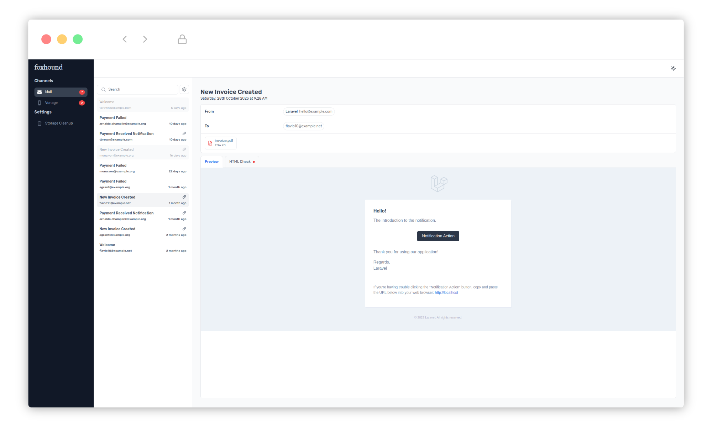

<p align="center"></p>

## Introduction

Foxhound is a lightweight notification intercepting package providing developers with a simple way to intercept and preview notifications during development.



## Installation

You can install the package vis Composer:

```bash
composer require codium/foxhound
```

After Foxhound is installed, publish its assets using the `foxhound:install` commannd.

```bash
php artisan foxhound:install
```

You can now access Foxhound at `http://localhost/foxhound` in your browser.

## Configuration

Foxhound's configuration file is located at `config/foxhound.php`. This file allows you to configure the package's behaviour.

## Credits

- [Beagle icon created by smalllikeart @ Flaticon](https://www.flaticon.com/free-icons/beagle)

## License

Foxhound is open-sourced software licensed under the [MIT license](LICENSE.md).
